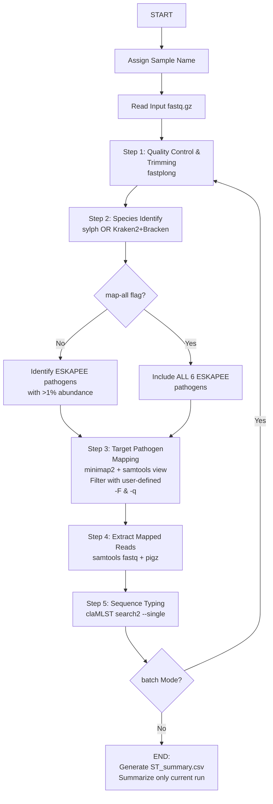

# nanoesst

A robust bioinformatics pipeline for 3rd-generation Nanopore sequencing data. It integrates QC (`fastplong`), species profiling (`sylph` or `Kraken2`), reference mapping to ESKAPEE pathogens (`minimap2` + `samtools`), and Sequence Typing (`claMLST`).

## Installation & Environment

Create a conda environment with all the required dependencies:

```bash
conda create -n nanoesst fastplong sylph minimap2 pymlst samtools pigz kraken2 bracken
conda activate nanoesst
```

Then, install this package directly from the source code:

```bash
git clone https://github.com/nacin0910/nanoesst.git
cd nanoesst
pip install -e .
```

## Advanced Usage & Parameters

`nanoesst` supports both `process` (single sample) and `batch` (folder mapping) modes.

### Global Optional Parameters:
* `-o, --outdir`: Specify the output directory (Default: `./`).
* `-f, --force`: If the output directory exists, setting this flag will completely clear it before running. *(Note: If outdir is the current directory `./`, it will safely only delete the numbered pipeline subfolders to protect your input data).*
* `--map-all`: Ignore the >1% species abundance requirement and force mapping the sample to ALL 6 ESKAPEE reference genomes.
* `-F, --filter-flag`: `samtools view -F` flag to discard specific reads (Default: `4` - removes unmapped alignments; and `2308` removes unmapped, secondary, and supplementary alignments).
* `-q, --min-mapq`: `samtools view -q` threshold for minimum mapping quality (Default: `10`).

---

### Run Examples

**1. Process Mode (Single Sample with Sylph, custom output directory, and force overwrite):**
```bash
nanoesst process -i raw/barcode01.fastq.gz -n SK-1 -a sylph -syldb path/to/database.syldb -t 16 -o ./results -f
```

**2. Batch Mode (Multiple Samples with Kraken2, Strict Mapping, and Map-All enabled):**
```bash
nanoesst batch -i ./raw_fastq_dir/ -n mapping.txt -a kraken -krakendb path/to/kraken_db -t 16 -o ./batch_out -q 20 --map-all
```
*(Note: `mapping.txt` should contain two columns: barcode and sample_name).*

---

### Output Structure & Results Interpretation

The pipeline creates organized subdirectories within your designated `-o` `--outdir`:

* `1.fastplong/`: Contains quality-controlled, trimmed fastq files.
* `2.1.sylph_out/` or `2.2.kraken_out/`: Contains the profiling results. The pipeline automatically scans these to identify which of the ESKAPEE pathogens exceed a 1% abundance threshold.
* `3.minimap2/`: Contains the strict BAM alignments (filtered by `-F` and `-q`) and the extracted high-confidence targeted `.fastq.gz` reads for each detected pathogen.
* `4.pymlst/`: Contains the raw text outputs from `claMLST`.
* **`ST_summary.csv`**: The master summary file generated at the root of your output directory. 

**Understanding `ST_summary.csv`:**
This file gathers all typing results for the current run into an easy-to-read table.
* **Sample**: Your provided sample name (e.g., `SK-1`).
* **Pathogen**: The identified ESKAPEE pathogen.
* **ST**: The predicted Sequence Type (e.g., `991`).
* **Genes**: A string of the housekeeping genes checked (e.g., `dinB-icdA-pabB-polB...`).
* **Type**: The specific allele numbers corresponding to the genes (e.g., `120-316-150-211...`).



